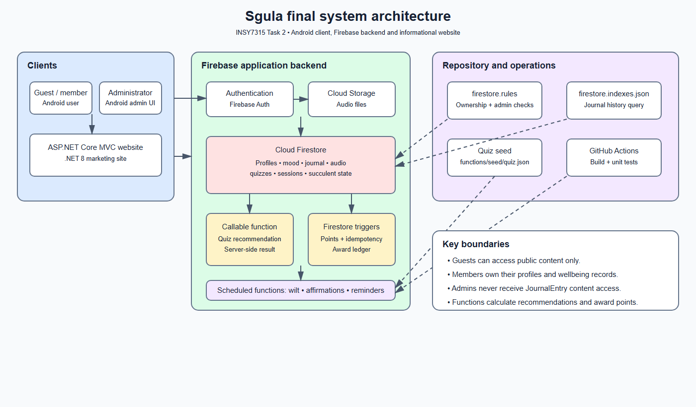
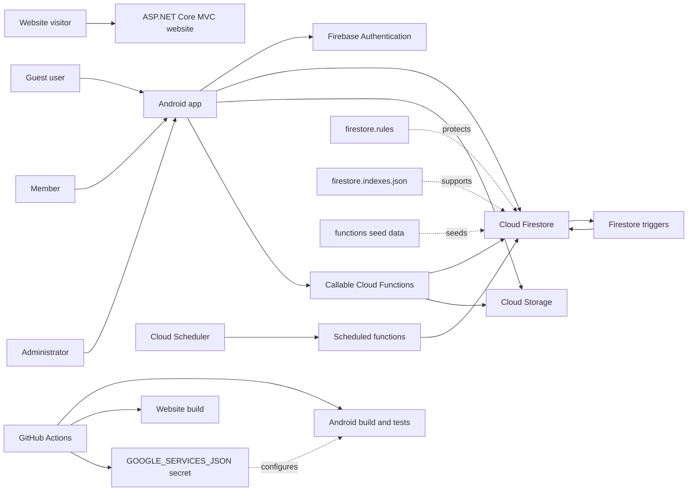

# Sgula final architecture

## Final architecture diagram

## Component responsibilities

| Component | Responsibility |
|---|---|
| Android app | Authentication UI, guest/member/admin navigation, wellbeing capture, audio playback, quiz UI and live succulent state. FirebaseWellnessRepository is the Firebase data-access boundary. |
| Firebase Authentication | Creates and signs in member accounts. The Firebase UID is the ownership key used throughout Firestore. |
| Cloud Firestore | Stores profiles, private wellbeing records, content metadata, quiz data, audio sessions and computed succulent state. |
| Cloud Storage | Stores uploaded audio files; Firestore stores their metadata and storage paths. |
| Callable Cloud Function | Validates quiz answers, calculates category scores, chooses an active audio recommendation, and writes the quiz result server-side. |
| Firestore-triggered Functions | Awards points after mood, journal, quiz and completed-audio events. Transactions plus SucculentPointAward make awards idempotent. |
| Scheduled Functions | Mark inactive succulents wilted after seven days, refresh the daily affirmation, and prepare enabled reminders. Scheduled functions run in europe-west1; Firestore and callable functions run in africa-south1. |
| Firestore rules and indexes | Enforce ownership/admin boundaries and support the journal history query. |
| Website | Presents the product and privacy model. It is intentionally decoupled from Firebase and has no application-data access. |

## Main runtime flows

### Member activity and points

1. The signed-in Android user creates a mood entry, journal entry, quiz result, or audio session.
2. Firestore rules verify the authenticated UID and validate the document shape.
3. A Firestore trigger calls awardSucculentPoints.
4. A transaction creates one point-award record and updates SucculentState with total points, stage, activity time and wilt status.
5. The Android app listens to the user's succulent state and updates the home screen.

### Quiz recommendation

1. The Android app sends quizId and answers to calculateQuizRecommendation.
2. The callable function requires authentication, loads the quiz questions, validates every answer, and scores the category weights.
3. It chooses an active AudioContent item in the winning category, writes quizResults, and returns the category and recommendation to the app.

### Privacy boundary

Journal entries are owned exclusively by their author. Administrators can view operational data such as profiles, audio sessions and succulent progress where rules allow, but the rules intentionally do not grant administrators access to JournalEntry content.

## Deployment and CI

Firebase deployment is controlled by firebase.json, .firebaserc, firebase/firestore.rules, firebase/firestore.indexes.json and the compiled functions project. GitHub Actions builds and tests the Android app and builds the website on pull requests and pushes to develop or main. The Android workflow injects google-services.json from the GOOGLE_SERVICES_JSON repository secret.
