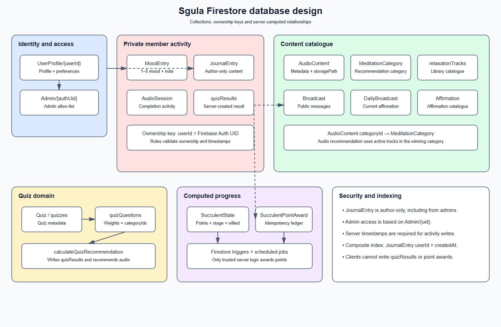

# Sgula Firestore database design

Firestore is a document database. Document IDs are shown in braces below; timestamps are server timestamps unless noted otherwise. The authoritative security policy is firebase/firestore.rules, while the Android collection names are centralised in FirestoreCollections.kt.

## Collections

| Collection | Document ID | Main fields | Purpose and ownership |
|---|---|---|---|
| Admin | {authUid} | name, role | Admin allow-list. The document ID must equal the Firebase Auth UID. |
| UserProfile | {userId} | userId, email, displayName, role, remindersEnabled, createdAt | Member profile and preferences. A member owns their profile; admins can manage profiles. |
| MoodEntry | {entryId} | userId, moodLevel, note, createdAt | Private 1–5 mood check-ins. Only the owner can read, update or delete. |
| JournalEntry | {entryId} | userId, content, prompt, createdAt, updatedAt | Private journal content. Only the author can read, update or delete; admins have no journal access. |
| AudioContent | {audioId} | title, description, category, categoryId, storagePath, downloadUrl, durationSeconds, active | Audio metadata and recommendation catalogue. Public read; admin write. |
| AudioSession | {sessionId} | userId, audioId, completed, status, durationSeconds, pointsAwarded | Playback/completion activity used for points and engagement. The owner creates it; owner/admin can read. |
| Broadcast | {broadcastId} | title, message, publishedAt | Therapist/admin broadcast content. Public read; admin write. |
| DailyBroadcast | current | affirmationId, text, dateDisplayed, updatedAt | Current daily affirmation, refreshed by a scheduled function. |
| Affirmation | {affirmationId} | text, category, dateDisplayed | Source affirmation catalogue. Signed-in read; admin write. |
| MeditationCategory | {categoryId} | name, description, recommendedFor | Categories used by quiz scoring and audio recommendations. Signed-in read; admin write. |
| relaxationTracks | {trackId} | title, categoryId, storagePath, durationSeconds | Relaxation-track catalogue used by the library. Public read; admin write. |
| Quiz / quizzes | {quizId} | title, description, active | Quiz metadata. Both names exist in the current schema for compatibility with existing data. |
| quizQuestions | {questionId} | quizId, questionText, options, categoryIds, weight, order | Question bank. The function uses categoryIds and weight to calculate recommendations. |
| quizResults | {resultId} | userId, quizId, answers, scores, recommendedCategoryId, recommendedAudioId, createdAt | Server-created quiz outcome. Clients cannot create or update results directly. |
| SucculentState | {userId} | userId, totalPoints, stage, wilted, lastActivityAt, updatedAt | Computed progress for the virtual succulent. User/admin read; admin-only direct writes. |
| SucculentPointAward | {reason}_{sourceId} | userId, reason, points, sourceId, createdAt | Idempotency ledger. Cloud Functions write it; only admins can read it. |

## Relationships and invariants

- UserProfile.userId, activity userId fields and SucculentState document IDs resolve to the Firebase Authentication UID.
- Admin/{uid} and UserProfile/{uid}.role == admin are both required by the documented admin setup process; Firestore rules use the Admin allow-list for authorization.
- quizQuestions.quizId points to a document in the quiz metadata collection, and each selected category ID points to MeditationCategory.
- quizResults.recommendedAudioId points to an active AudioContent document when a matching track exists. AudioContent.storagePath points to the corresponding Cloud Storage object.
- A source activity is awarded once: the Cloud Function uses {reason}_{sourceId} as the award document ID and checks it inside a transaction.
- Succulent stages are derived from total points: seed (<100), sprout (100–299), growing (300–599), and blooming (600+). A scheduled job marks a state wilted after seven days without activity.

## Security model

| Data | Guest | Signed-in member | Admin |
|---|---:|---:|---:|
| Public audio/broadcast content | Read | Read | Read/write |
| Own profile and activity | No | Read/write own data | Read/write where rules allow |
| Other member activity | No | No | Operational data only where rules allow |
| Journal content | No | Own entries only | No access |
| Quiz recommendation call | No | Allowed | Allowed as an authenticated user |
| SucculentPointAward | No | No | Read only |

Rules also validate allowed fields, value types, mood ranges, content lengths, ownership-preserving updates and server timestamps. The journal history query is supported by the composite index on JournalEntry(userId ASC, createdAt DESC) in firebase/firestore.indexes.json.
